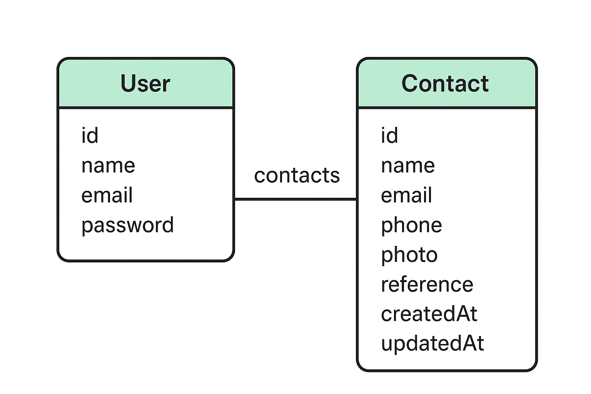

# Contact Manager API

## Descrição

A **Contact Manager API** é uma aplicação backend desenvolvida com NestJS, Prisma e PostgreSQL, projetada para gerenciar contatos de forma eficiente e segura. Esta API oferece funcionalidades de CRUD (Criar, Ler, Atualizar, Deletar) para contatos, autenticação de usuários e upload de fotos de perfil.

O projeto foi desenvolvido como parte do desafio do repositório [developer-challenge](https://github.com/zeine-inc/developer-challenge).

---

## Funcionalidades

- **Cadastro de Usuários**: Permite que novos usuários se registrem no sistema.
- **Autenticação JWT**: Implementa autenticação baseada em JSON Web Tokens para segurança.
- **Gestão de Contatos**: CRUD completo para contatos, incluindo nome, e-mail, telefone, foto e referência.
- **Upload de Fotos**: Suporte para upload de fotos de perfil dos contatos.
- **Validação de Dados**: Utiliza Zod para validação de dados de entrada.
- **Filtro de Contatos**: Busca contatos por letra inicial do nome.
- **Mensagem Secreta**: Tooltip especial ao manter o mouse sobre “Adicionar contato” por 7 segundos.

---

## Tecnologias Utilizadas

- **Backend**: NestJS
- **ORM**: Prisma
- **Banco de Dados**: PostgreSQL
- **Autenticação**: JWT (JSON Web Tokens)
- **Validação**: Zod
- **Upload de Arquivos**: Multer
- **Testes**: Vitest

---

## Diagrama ERD



## Teste de Requisição

O arquivo  `client.http` contém exemplos prontos de requisição HTTP para facilita o teste e a simulação da rota da API

- Cadastro de usuário
- Autenticação
- Criação, listagem, atualização e deleção de contato
- Upload de foto

Você pode utilizá-lo diretamente no VS Code (com a extensão **REST Client**) para enviar requisição à API sem precisar de ferramentas externas como Postman.

Exemplo de uso:

1. Abra o arquivo `client.http` no VS Code.
2. Clique em **Send Request** acima da requisição que deseja testar.
3. Visualize a resposta diretamente no editor.

## Como Rodar a Aplicação

### Pré-requisitos

Antes de iniciar, certifique-se de ter instalado:

- Node.js (recomendado: versão 16.x ou superior)
- PostgreSQL
- Docker

---

### Passos para Executar Localmente

1. **Clonar o repositório**

```bash
git clone https://github.com/ericajv/contact-manager-api.git
cd contact-manager-api
````
 
```bash
npm install
````
3. **Configurar o banco de dados**
- Crie um banco de dados PostgreSQL chamado `contact_manager`.
- Copie o arquivo `.env.example` para `.env` e configure as variáveis de ambiente, incluindo `DATABASE_URL`.

4. Rodar as migrações do Prisma
```bash
npx prisma migrate dev
````
5. **Iniciar a aplicação**
```bash
npm run start:dev
````
A API estará disponível em http://localhost:3333.

---

### Rodando com Docker Compose

Construir e iniciar os containers:
```bash
docker-compose up --build
```
